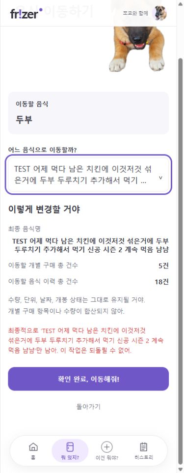

# 음식 이동 및 날짜 경과 표시 결과

작성일: 2026-09-14

## 구현 결과

- 개별 구매 목록: 기존 경고 아이콘 제거. 유통기한·소비기한·구매일·개봉일 옆에 `(+N일)` 표시. 최종 날짜 배치는 2열(유통/소비, 구매/개봉)이며 왼쪽 열은 왼쪽, 오른쪽 열은 오른쪽 정렬한다. 네 날짜 영역만 1pt 축소하며 좁은 화면에서는 열 안에서 줄바꿈한다. 날짜와 경과 일수 사이 공백 한 칸을 보존한다.
- 개별 구매 항목: 기존 경고 문구·아이콘 유지, 각 날짜와 냉동 보관 시작일에 같은 경과 표시 추가.
- 공통 날짜 표시 fragment는 기존 화면의 `today`와 `ChronoUnit.DAYS`를 사용한다. 오늘은 `(+0일)`, 미래·미입력 날짜는 경과 표시 없음. 경고 판정과 날짜 값은 변경하지 않는다.
- 이력의 표시 태그는 ‘이동’, 홈 최근 기록은 ‘개별 구매 N건을 이동했어’로 변경했다. 내부 MERGE 구분·저장 테이블·영수증은 유지한다.
- 음식 이동 화면의 제목·설명·버튼을 사용자 지정 문구로 변경하고, 미리보기 완료 상태 문장은 제거했다. 진입 버튼과 성공·실패 안내도 이동 표현으로 맞췄다.
- 음식 선택은 기존 select/미리보기 연동을 유지하는 펼침 목록으로 개선했다. 선택지와 선택된 값은 너비 안에서 최대 2줄 말줄임하며 원문은 접근성 이름·title에 보존한다. 화살표·Home·End·Enter·Escape, 선택 해제·바깥 클릭·뒤로 복원·제출 중 선택 방지를 지원한다.
- 최종 음식명은 라벨 다음 행의 전체 너비를 사용하고, 오른쪽 정렬·왼쪽→오른쪽 읽기 방향·단어 중심 줄바꿈을 적용했다.
- 등록/기존 음식 추가/수정의 공통 취소 링크에 돌아가기와 같은 hover·키보드 focus 배경 적용.

## 당시 검증

아래 388개는 이동 UI 구현 시점의 결과다. 최종 전체 검증은 [작업 정리](SESSION_SUMMARY.md)와 [테스트 실행 목록](STEP3_TEST_CASES.md)을 따른다.

- 전체 Java 388개, 실패·오류·건너뜀 0, `test bootJar` 성공.
- 날짜 미입력·과거·오늘·미래를 양쪽 구매 화면에서 검증하는 4개 테스트 추가. 목록 아이콘 제거와 항목 아이콘 유지 확인.
- 기존 food-merge JS 검사 통과: 늦은 응답·실패/재시도·대상 불일치·중복 제출·페이지 복원.
- 신규 food-target-picker JS 검사 통과: 긴 원문 보존·선택·해제·키보드·제출 중 잠금·바깥 클릭·복원.
- 브라우저 320/390/448px: 이동 화면과 양쪽 구매 화면에서 가로 넘침 없음. 선택값 2줄, 팝업 너비가 필드 너비를 넘지 않음. 긴 이름 선택 후 올바른 미리보기 확인. 실제 이동 제출은 하지 않았다.
- 취소 링크 키보드 포커스 배경 `#F7F7FB`와 이동 동작 확인.
- 사용자 데이터 변경·앱 재시작 없음. Java로 생성하는 이력 태그·홈 요약·성공/오류 문구는 앱 재시작 후 반영된다.

## 당시 미리보기

아래 이미지는 이동 UI 구현 당시 화면이며 이후 되돌릴 수 없음 안내의 명시적 줄바꿈이 추가되었다.

## 변경 파일

- `templates/inventory/master.html`, `detail.html`, `merge.html`, `fragments/shell.html`
- `static/css/app.css`, `static/js/food-merge.js`, `static/js/food-target-picker.js`
- `history/dto/HistoryEntry.java`, `inventory/controller/FoodMasterController.java`, `inventory/service/FoodMasterService.java`
- 관련 Java 및 JavaScript 테스트, STEP 3 결과 문서
