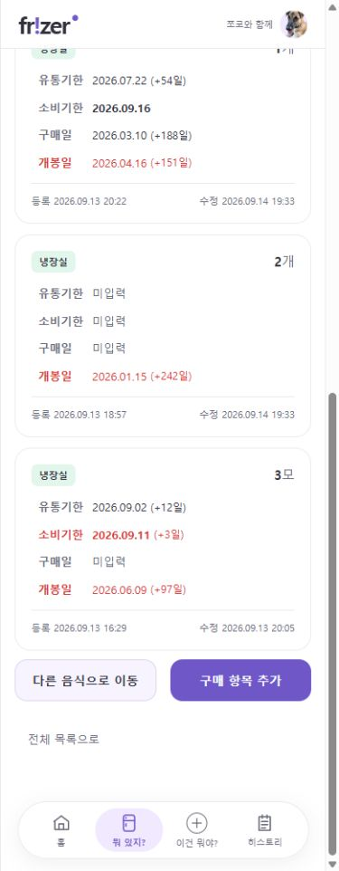

# 히스토리 구분 및 구매 화면 버튼 정리

작성일: 2026-09-14

## 구현 결과

- 히스토리의 수정 전후 및 이동 이름 사이 화살표를 먹색·16px·굵은 글자·좌우 여백으로 강조했다. 등록 스냅샷 원문은 그대로 표시한다. 문자열은 HTML로 해석하지 않고 Thymeleaf로 이스케이프한다.
- 수량에 붙이던 ‘기존 입력’ 문구를 생성하지 않는다. 기존 변경값 비교를 그대로 사용해 값이 동일한 수량은 변경 행에 포함되지 않는다. 단위 등 실제 변경은 계속 저장한다.
- 과거 기록을 렌더링 때 보정하는 전용 코드 및 숫자 파싱 보정은 추가하지 않았다. 개발 DB에서 확인된 history_id=6 한 건만 원문 일치 조건으로 수정하여 `수량: 1 (기존 입력) → 1`을 제거하고 `단위: - → 모`를 유지했다. 재사용 migration이나 실행 시 자동 보정은 없다.
- 이동 화면의 ‘이 작업은 되돌릴 수 없어.’ 앞에 명시적인 줄바꿈 적용.
- 개별 구매 목록의 첫 버튼 행은 ‘다른 음식으로 이동 / 구매 항목 추가’, 너비 5:5. ‘전체 목록으로’는 다음 행 전체 너비·가운데 정렬로 배치한다(후속 요청 반영).
- 양쪽 구매 화면의 ‘전체 목록으로 / 개별 목록으로’는 수정 취소와 같은 cancel-link 스타일 사용. 기본 테두리 0, hover·키보드 focus 효과 유지.

## 당시 검증

아래 브라우저 기록은 하단 링크가 왼쪽 정렬이었던 시점이다. 최종 버튼·날짜 규격은 [작업 정리](SESSION_SUMMARY.md)를 따른다.

- 전체 Java 389개, 실패·오류·건너뜀 0 및 빌드 성공.
- 변경 없는 수량 행 제외·실제 단위 변경 기록·동일 값 재저장 시 추가 이력 없음 검증.
- 320/390/448px에서 두 버튼 동일 너비·동일 행, 아래 링크 왼쪽 정렬·테두리 0·가로 넘침 없음 확인.
- 실제 히스토리에서 테스트 기록 정리, 화살표 강조 확인. 이동 안내의 명시적 줄바꿈 확인.
- 앞으로의 변경값 생성 규칙은 앱 재시작 후 적용된다. 템플릿·스타일과 기존 개발 기록 일회성 정리는 현재 화면에서 확인 가능하다.

아래 이미지는 전체 목록으로 버튼의 전체 너비 변경 전 기록이다.

