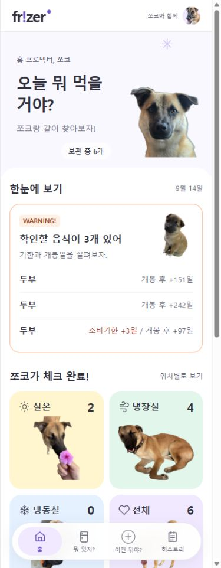

# 홈 WARNING 한 줄 목록 수정 결과

작성일: 2026-09-14. 이전 여러 줄 목록·배지 지시를 대체하는 최신 결과.

## 최종 색상 갱신

- 홈 배경 #FFFFFF, 테두리 #FF4040, WARNING 태그 배경 #FFF5F5, 태그·기한 경과 글자 #D93636. 개봉 참고 정보·당일·구분자는 #696B7A 유지.
- 다른 탭의 기존 경고 문구는 #D93636, 경고 아이콘 배경은 #FF6B6B로 통일. 경고 안내 배경·테두리도 동일 의미 토큰 사용. 아이콘 색이 입력 오류의 작은 글자에 전파되지 않도록 오류 문구는 경고 글자 토큰에 연결.
- 브라우저에서 홈·전체 음식·개별 구매 목록·개별 구매 항목의 실제 계산 색상 확인. primary와 기록·보관 위치 토큰은 유지. 이번 변경은 CSS만 수정했으며 아래 90개 테스트는 앞선 목록 기능 검증 결과다.

## 구현 결과

- 배지는 `WARNING!`, 배경 `#FFF0E5`, 글자 `#9A431C`로 변경했다. 카드는 흰색과 기존 모서리·상단 배치를 유지하며, 테두리는 투명도 없는 `1px solid #FFB38A`다.
- 음식명 왼쪽·사유 오른쪽의 44px 한 줄 목록으로 변경했다. 보관 위치·구매일 보조 줄은 제거했다. 이름 15px, 사유 13px이며 양쪽에 min-width:0과 말줄임을 적용했다. DOM과 접근성 이름에는 전체 텍스트를 남긴다.
- 과거 날짜만 ‘소비기한 +N일’, ‘유통기한 +N일’, ‘개봉 후 +N일’로 표현한다. 복수 사유 구분은 `/`이며 오늘 문구는 유지한다. 소비·유통기한 경과는 코랄, 개봉 경과는 회색이다.
- 전체 대상 목록과 정렬·제목 집계는 유지하고 템플릿에서 첫 3개만 출력한다. 내부 스크롤은 없다.
- 히스토리의 ‘이전 등록 기록은 당시 저장된 항목만 표시해.’ 안내만 제거했다. 데이터나 과거 기록은 삭제하지 않았다.
- 홈의 다른 영역, API, 날짜 계산, 경고 기준, 쪼코 선택 로직은 변경하지 않았다.

## 자동 검증

- `test --tests '*InventoryIntegrationTest'`: 90개 통과, 실패·오류·건너뜀 0.
- 대상 0/1/3/4/100개에서 표시 0/1/3/3/3개, 모델 전체 건수·순서 및 제목 검증.
- 기존 64가지 날짜 조합과 오늘·미래 날짜·날짜 미상 검사 통과.
- 상세 화면에 전체 이름과 소비기한·개봉일이 남아 있음을 검증.

## 브라우저 검증

- 격리 DB의 실제 템플릿 렌더링 결과로 5개 건수 × 320/390/448px, 총 15조합 확인. 가로 넘침·사진 겹침·행 내용 겹침 없음, 모든 행 44px.
- 긴 음식명·복수 사유는 한 줄 말줄임이며 접근성 링크 이름에는 전체 문구가 보존됨.
- 사용자 8080의 경고 링크에서 `/inventory/4`로 이동하여 전체 이름, 소비기한, 개봉일 확인. 히스토리 안내 문구 제거 확인.
- 사용자 데이터는 변경하지 않았으며 임시 미리보기 서버는 종료했다.

[실제 홈 320px](ui-v5-addon/home-warning-compact-320.png) · [100개·긴 이름 테스트 320px](ui-v5-addon/home-warning-compact-100-320.png)

## 남은 연결 작업

### 2026-09-15 연결 구현

후속 UI 수정: 홈 링크 문구는 '전체 확인하기'이며 전체 목록으로 버튼의 기본·호버 색상을 공유한다. 경고 필터는 보관 위치 태그 옆에 배치하고 좁은 화면에서는 줄바꿈한다. 체크박스는 14px, 문구와 간격은 4px이며 라벨 클릭으로도 전환한다. 개별 구매 목록에도 같은 GET 필터를 제공하고 위치 조건을 보존한다. 조건 건수 안내와 구매 목록의 필터 설명 문장은 제거했다. 아래의 전체 N개 보기와 보조 안내는 최초 구현 당시 기록이다.

- 홈의 전체 N개 보기는 `/inventory?warning=true`로 이동한다. 보관 위치 아래의 '확인이 필요한 음식만' 선택과 함께 사용한다.
- `FoodItem.needsReview(today)`에 기존 홈 WARNING 조건을 모아 홈·전체 음식·개별 구매 목록에서 공유한다. 기한 당일도 포함하며 소비기한 우선, 개봉 3개월 초과 정책을 유지한다.
- 음식 그룹은 ID 기준으로 유지한다. 제목은 음식 그룹 수, 보조 안내는 조건에 맞는 구매 항목 수, 카드에는 확인할 구매 N건 / 전체 M건을 표시한다.
- 구매 목록과 개별 구매 항목의 복귀 링크에 `storage`와 `warning`을 보존한다. 조회 필터이며 구매 항목 추가·수정·이동의 저장 계약은 바꾸지 않는다.
- 검증: `InventoryIntegrationTest` 104개와 `FoodMergeIntegrationTest` 17개, 총 121개 실패·오류 없이 통과했고 bootJar도 성공했다. 기한 당일·소비기한 우선·개봉 경계일·동일 이름의 다른 ID·전체/조건부 구매 건수·복귀 링크를 확인했다. 전체 테스트를 재실행한 결과는 아니다.
- 실제 8082 화면에서 홈 전체 보기, 위치와 경고 조건 조합, 구매 목록 복귀, 체크 해제 후 위치 유지 동작을 확인했다. 320px 화면에서 가로 넘침이 없었다. 사용자 데이터와 8080 프로세스는 변경하지 않았으며, 8080에는 Java 변경 반영을 위한 한 번의 재시작이 필요하다.

아래는 연결 구현 이전 기록이다.

기존 `/inventory`는 보관 위치 필터만 지원하며 음식 그룹 단위 목록이다. WARNING 전체 대상만 조회하는 필터·라우트는 없다. 사용자 지시에 따라 작동하지 않는 ‘전체 N개 보기’ 링크나 일반 전체 목록으로 오인하게 하는 링크를 추가하지 않았다.

전체 보기를 완성하려면 홈과 동일한 판정(기한 경과·기한 당일·개봉 3개월 초과)을 사용하는 전체 개별 항목 필터/화면을 연결해야 한다. 오늘 기한 대상도 포함되어야 하므로 `needsAttention()`만 재사용하면 홈 대상과 달라진다. 이번에는 새로운 경고 기준이나 라우트를 추가하지 않았다.

## 히스토리 저장 방식

- 등록·수정 원본: `food_history`의 당시 음식명, 변경 내용/등록 스냅샷, 시각 등.
- 합치기 원본: `food_merge_receipt`의 원래 음식·대상 음식·항목 수·시각 등.
- 현재 연결 대상: 현재 `food_item`·`food_master` 및 합치기 연결 관계로 조회 시 계산.
- 이동 안내, 배지 문구, 표시용 문장: 저장된 값을 바탕으로 화면에서 구성. 화면 문장 전체가 그대로 테이블에 저장되는 것은 아니다.
