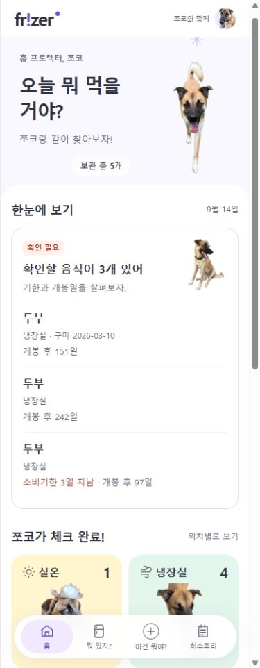

# 홈 확인 필요 카드 수정 결과

작성일: 2026-09-14

이 문서는 초기 여러 줄 목록의 구현·검증 기록이다. 이후 사용자 요청으로 대체되었으므로 현재 화면은 [한 줄 목록 최종 결과](HOME_WARNING_COMPACT_REVIEW.md)와 [작업 정리](SESSION_SUMMARY.md)를 따른다.

## 당시 구현 결과

- WARNING 카드 내부만 흰색 배경, 코랄 테두리, 작은 ‘확인 필요’ 배지로 변경했다. 의미 토큰은 `.overview-card`의 `--attention-*`로 한정했다.
- 음식명 → 중복 이름의 보관 위치·구매일 → 확인 사유 순서로 배치했다. 긴 이름과 사유는 생략 없이 줄바꿈한다.
- 소비·유통기한 경과는 ‘N일 지남’, 오늘은 ‘오늘’로 표시한다. 개봉일이 과거면 ‘개봉 후 N일’, 당일이면 ‘오늘 개봉’으로 표시한다. 목록에 이미 포함된 음식에만 개봉 참고 정보를 표시하며, 미래 날짜·미상 날짜를 경과로 표현하지 않는다.
- 기한 경과만 코랄로 강조하고 개봉 경과는 회색으로 표시한다. 기존 개봉 3개월 초과 판정, 대상·정렬·건수·날짜 차이 계산·API·이미지 선택 정책은 유지했다.
- 공통 헤더, 보관 위치 4개 카드, primary 색, 경고 없는 정상 카드의 템플릿·스타일은 변경하지 않았다.
- 추가 요청: 합치기 기록의 안내를 ‘합치기 이력이 있어 클릭 시 ‘두부’로 이동해.’ 형식으로 변경하고 상세 필드는 ‘개별 항목 3건’ 형식으로 단축했다. 기존 등록·수정 이력의 당시 이름 보존과 링크는 유지한다.

## 검증 결과

- 전체 `test bootJar`: Java 379개, 실패·오류·건너뜀 0, 빌드 성공.
- 기존 64가지 기한·개봉일 조합으로 경고 대상 유지 검증. 중복 이름·실제 구매일·구매일 없음·오늘 개봉·미래 날짜와 순서 검증 추가.
- 실제 8080 홈: 3개 경고와 `/inventory/6` 상세 이동 확인, 콘솔 경고·오류 0. 사용자 데이터 변경 없음.
- 격리 DB로 실제 홈 템플릿을 렌더링한 단일/복수/정상 화면을 320/390/448px에서 확인했다. 긴 이름 줄바꿈, 가로 넘침 없음, 사진과 문구 겹침 없음. 검증용 서버 종료.
- 글자 대비: 본문/흰색 12.86:1, 회색/흰색 5.27:1, 코랄/흰색 6.23:1, 배지 5.62:1.
- `git diff --check` 통과.

## 미리보기

실제 데이터의 390px 홈:

[320px 실제 홈](ui-v5-addon/home-warning-320.png) · [320px 긴 이름 테스트 데이터](ui-v5-addon/home-warning-long-320.png)

## 남은 제약

- 실제 ‘두부’ 2개 항목은 구매일이 없고 보관 위치가 모두 냉장실이어서 보조 정보만으로 완전히 구별할 수 없다. 없는 정보를 만들거나 API를 확장하지 않았다. 개봉 사유와 기존 개별 상세 링크는 각각 유지한다.
- 홈 템플릿·CSS는 새로고침하면 적용된다. Java로 생성하는 합치기 안내·필드명은 실행 앱 재시작이 필요하다.
