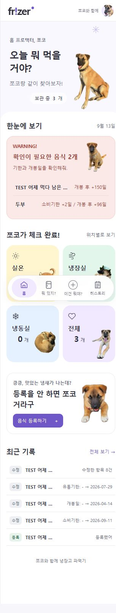
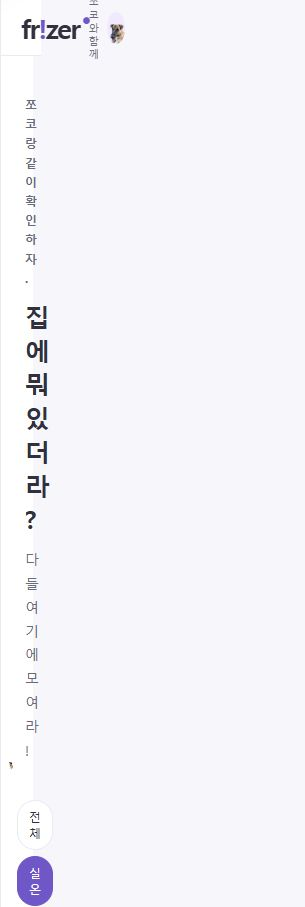
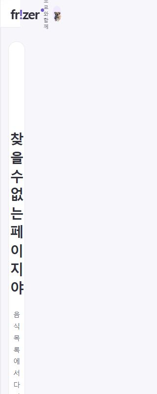
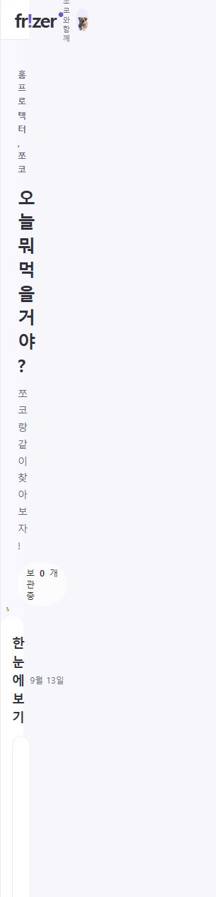
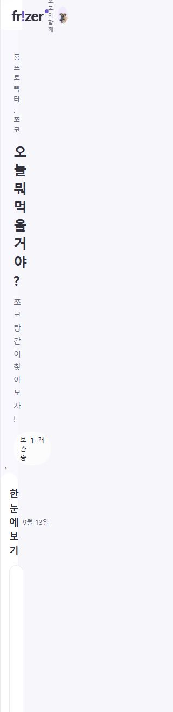

# 최종 쪼코 이미지 정책 및 검증

2026-09-13. 사용자가 전달한 최종 명세를 적용했다. 표정은 UI 분위기 분류이며 사진의 실제 감정 판정이 아니다. 이전 CURRENT_IMAGE_MAPPING의 조정 제안 및 공통 A fallback 설명은 이 문서로 대체한다.

## 선택 정책

허용 구도와 역할을 먼저 적용하고 같은 화면의 사용 파일을 제외한다. **우선 분위기에서 사용할 파일이 남아 있으면 차선으로 넘어가지 않는다.** 같은 단계에서 포즈 중복 회피 → 영역 직전 사진 회피 → 최근 80회 노출 빈도 → 명시된 선호 후보 → 무작위 순서다.

프로필은 먼저 점유하며 노출 집계에서 제외한다. 오류를 다른 보조 영역보다 먼저 배정하며 새 오류와 충돌한 기존 보조 영역은 재선택한다. 오류 로드 실패는 WAITING 네 장 안에서만 재시도하고 소진되면 이미지만 생략한다. 일반 영역은 입력·리렌더·크기 변경 시 유지한다.

sessionStorage `frizer.choco.global.v2`로 관리한다. v1의 유효한 최근 노출·직전 선택은 선호 정보로 이관하고 이전 저장 키는 정리한다. 화면 배정은 저장/재사용하지 않으며 현재 정책으로 새로 선택한다. 저장소 실패 시 메모리로 동작한다.

## 사진별 메타데이터

allowedRoles는 구도상 허용 범위다. 실제 선택에는 다음 표의 표정 정책까지 교차 적용한다.

| 사진 | emotionGroup | poseGroup | renderMode | allowedRoles |
|---|---|---|---|---|
| `empty-curious.png` | WAITING | tilt-portrait | portrait | `error` |
| `rest.png` | REST | sleep-portrait | portrait | `rest` |
| `sniff.png` | REST | side-portrait | left-edge | `loading` |
| `happy-closeup.png` | HAPPY | front-portrait | portrait | `profile` |
| `leaf-hat-front.png` | REST | leaf-lounge | contain | `fridge` |
| `leaf-hat-side.png` | REST | leaf-lounge | contain | `fridge` |
| `proud-sit.png` | NEUTRAL | adult-sit | contain | `home-hero`, `list-header`, `detail-header`, `history-header`, `error-header`, `add-header`, `edit-header`, `warning`, `rest`, `room`, `fridge`, `freezer`, `all`, `success-create`, `success-consume`, `success-discard`, `banner`, `empty`, `error` |
| `look-aside.png` | HAPPY | adult-sit | contain | `home-hero`, `list-header`, `detail-header`, `history-header`, `error-header`, `add-header`, `edit-header`, `warning`, `rest`, `room`, `fridge`, `freezer`, `all`, `success-create`, `success-consume`, `success-discard`, `banner`, `empty`, `error` |
| `happy-sit.png` | HAPPY | adult-sit | contain | `home-hero`, `list-header`, `detail-header`, `history-header`, `error-header`, `add-header`, `edit-header`, `warning`, `rest`, `room`, `fridge`, `freezer`, `all`, `success-create`, `success-consume`, `success-discard`, `banner`, `empty`, `error` |
| `happy-lounge.png` | HAPPY | lying-rest | contain | `home-hero`, `list-header`, `detail-header`, `history-header`, `error-header`, `add-header`, `edit-header`, `warning`, `rest`, `room`, `fridge`, `freezer`, `all`, `success-create`, `success-consume`, `success-discard`, `banner`, `empty`, `error` |
| `puppy-sit.png` | WAITING | puppy-sit | contain | `empty`, `error` |
| `puppy-tilt.png` | NEUTRAL | puppy-sit | contain | `home-hero`, `list-header`, `detail-header`, `history-header`, `error-header`, `add-header`, `edit-header`, `warning`, `rest`, `room`, `fridge`, `freezer`, `all`, `success-create`, `success-consume`, `success-discard`, `banner`, `empty`, `error` |
| `puppy-ready.png` | NEUTRAL | puppy-sit | contain | `home-hero`, `list-header`, `detail-header`, `history-header`, `error-header`, `add-header`, `edit-header`, `warning`, `rest`, `room`, `fridge`, `freezer`, `all`, `success-create`, `success-consume`, `success-discard`, `banner`, `empty`, `error` |
| `cozy-curl.png` | REST | curled | contain | `warning`, `rest`, `room`, `fridge`, `freezer`, `all`, `success-create`, `success-consume`, `success-discard`, `banner`, `empty`, `error` |
| `come-running.png` | HAPPY | walking | contain | `add-header`, `edit-header`, `success-create`, `success-consume`, `banner` |
| `puppy-front-paws.png` | HAPPY | puppy-front | contain | `add-header`, `edit-header`, `success-create`, `success-consume`, `banner`, `all` |
| `extra-chin-on-paw.png` | WAITING | lying-rest | contain | `empty`, `error`, `banner`, `room`, `fridge`, `freezer`, `all` |
| `extra-curled-smile.png` | REST | curled | contain | `warning`, `rest`, `room`, `fridge`, `freezer`, `all`, `success-create`, `success-consume`, `success-discard`, `banner`, `empty`, `error` |
| `extra-sunny-sit.png` | HAPPY | adult-sit | contain | `home-hero`, `list-header`, `detail-header`, `history-header`, `error-header`, `add-header`, `edit-header`, `warning`, `rest`, `room`, `fridge`, `freezer`, `all`, `success-create`, `success-consume`, `success-discard`, `banner`, `empty`, `error` |
| `extra-tongue-step.png` | HAPPY | walking | contain | `home-hero`, `list-header`, `detail-header`, `history-header`, `error-header`, `add-header`, `edit-header`, `warning`, `rest`, `room`, `fridge`, `freezer`, `all`, `success-create`, `success-consume`, `success-discard`, `banner`, `empty`, `error` |
| `extra-puppy-gaze.png` | WAITING | puppy-sit | contain | `empty`, `error`, `banner`, `room`, `fridge`, `freezer`, `all` |

## 영역별 최종 실제 후보

각 셀은 구도와 표정 제약을 모두 적용한 실제 후보다. 같은 단계의 그룹들은 동등하다.

| 영역 | 우선 | 차선 | 3순위 | 선호 후보 |
|---|---|---|---|---|
| 공통 프로필 (`profile`) | `happy-closeup.png` | 없음 | 없음 | `happy-closeup.png` |
| 홈 헤더 (`home-hero`) | `look-aside.png`, `happy-sit.png`, `happy-lounge.png`, `extra-sunny-sit.png`, `extra-tongue-step.png` | `proud-sit.png`, `puppy-tilt.png`, `puppy-ready.png` | 없음 | `happy-lounge.png`, `happy-sit.png`, `proud-sit.png` |
| 목록 헤더 (`list-header`) | `proud-sit.png`, `puppy-tilt.png`, `puppy-ready.png` | `look-aside.png`, `happy-sit.png`, `happy-lounge.png`, `extra-sunny-sit.png`, `extra-tongue-step.png` | 없음 | 없음 |
| 상세 헤더 (`detail-header`) | `proud-sit.png`, `puppy-tilt.png`, `puppy-ready.png` | `look-aside.png`, `happy-sit.png`, `happy-lounge.png`, `extra-sunny-sit.png`, `extra-tongue-step.png` | 없음 | 없음 |
| 히스토리 헤더 (`history-header`) | `proud-sit.png`, `puppy-tilt.png`, `puppy-ready.png` | `look-aside.png`, `happy-sit.png`, `happy-lounge.png`, `extra-sunny-sit.png`, `extra-tongue-step.png` | 없음 | 없음 |
| 별도 오류 헤더 (현재 미사용) (`error-header`) | `proud-sit.png`, `puppy-tilt.png`, `puppy-ready.png` | `look-aside.png`, `happy-sit.png`, `happy-lounge.png`, `extra-sunny-sit.png`, `extra-tongue-step.png` | 없음 | 없음 |
| 등록 헤더 (`add-header`) | `look-aside.png`, `happy-sit.png`, `happy-lounge.png`, `come-running.png`, `puppy-front-paws.png`, `extra-sunny-sit.png`, `extra-tongue-step.png` | `proud-sit.png`, `puppy-tilt.png`, `puppy-ready.png` | 없음 | `come-running.png`, `puppy-front-paws.png` |
| 수정 헤더 (`edit-header`) | `proud-sit.png`, `puppy-tilt.png`, `puppy-ready.png` | `look-aside.png`, `happy-sit.png`, `happy-lounge.png`, `come-running.png`, `puppy-front-paws.png`, `extra-sunny-sit.png`, `extra-tongue-step.png` | 없음 | 없음 |
| 홈 WARNING (`warning`) | `proud-sit.png`, `puppy-tilt.png`, `puppy-ready.png` | 없음 | 없음 | 없음 |
| 홈 확인할 음식 없음 (`rest`) | `rest.png`, `cozy-curl.png`, `extra-curled-smile.png` | 없음 | 없음 | 없음 |
| 홈 등록 음식 없음·빈 목록·빈 히스토리 (`empty`) | `puppy-sit.png`, `extra-chin-on-paw.png`, `extra-puppy-gaze.png` | `proud-sit.png`, `puppy-tilt.png`, `puppy-ready.png` | 없음 | 없음 |
| 오류·없는 페이지 본문 (`error`) | `empty-curious.png`, `puppy-sit.png`, `extra-chin-on-paw.png`, `extra-puppy-gaze.png` | 없음 | 없음 | 없음 |
| 등록 완료 (`success-create`) | `look-aside.png`, `happy-sit.png`, `happy-lounge.png`, `come-running.png`, `puppy-front-paws.png`, `extra-sunny-sit.png`, `extra-tongue-step.png` | `proud-sit.png`, `puppy-tilt.png`, `puppy-ready.png` | 없음 | 없음 |
| 소비 완료 (현재 UI 없음) (`success-consume`) | `look-aside.png`, `happy-sit.png`, `happy-lounge.png`, `come-running.png`, `puppy-front-paws.png`, `extra-sunny-sit.png`, `extra-tongue-step.png` | `proud-sit.png`, `puppy-tilt.png`, `puppy-ready.png` | 없음 | 없음 |
| 폐기 완료 (현재 UI 없음) (`success-discard`) | `proud-sit.png`, `puppy-tilt.png`, `puppy-ready.png` | 없음 | 없음 | 없음 |
| 등록 유도 배너 (`banner`) | `look-aside.png`, `happy-sit.png`, `happy-lounge.png`, `come-running.png`, `puppy-front-paws.png`, `extra-chin-on-paw.png`, `extra-sunny-sit.png`, `extra-tongue-step.png`, `extra-puppy-gaze.png` | `proud-sit.png`, `puppy-tilt.png`, `puppy-ready.png` | 없음 | 없음 |
| 실온 카드 (`room`) | `proud-sit.png`, `look-aside.png`, `happy-sit.png`, `happy-lounge.png`, `puppy-tilt.png`, `puppy-ready.png`, `extra-sunny-sit.png`, `extra-tongue-step.png` | `extra-chin-on-paw.png`, `extra-puppy-gaze.png` | 없음 | 없음 |
| 냉장실 카드 (`fridge`) | `leaf-hat-front.png`, `leaf-hat-side.png`, `cozy-curl.png`, `extra-curled-smile.png` | `proud-sit.png`, `puppy-tilt.png`, `puppy-ready.png`, `extra-chin-on-paw.png`, `extra-puppy-gaze.png` | 없음 | `leaf-hat-front.png`, `leaf-hat-side.png` |
| 냉동실 카드 (`freezer`) | `cozy-curl.png`, `extra-curled-smile.png` | `proud-sit.png`, `puppy-tilt.png`, `puppy-ready.png`, `extra-chin-on-paw.png`, `extra-puppy-gaze.png` | 없음 | `cozy-curl.png`, `extra-curled-smile.png` |
| 전체 카드 (`all`) | `look-aside.png`, `happy-sit.png`, `happy-lounge.png`, `puppy-front-paws.png`, `extra-sunny-sit.png`, `extra-tongue-step.png` | `proud-sit.png`, `puppy-tilt.png`, `puppy-ready.png` | `extra-chin-on-paw.png`, `extra-puppy-gaze.png` | 없음 |
| 로딩 (현재 UI 없음) (`loading`) | `sniff.png` | 없음 | 없음 | `sniff.png` |

## 구도 제한과 생략

- puppy-sit: 빈 상태·오류만. 헤더·등록 배너·보관 카드에서는 제외.
- empty-curious: 승인된 투명 PNG 그대로, 오류 카드 하단에 상반신을 붙이는 배치만.
- sniff: 왼쪽 가장자리 로딩 후보만 유지. 새 로딩 UI는 만들지 않았다.
- rest: 휴식 안내의 얼굴 배치만. leaf-hat 두 장은 기존 냉장실 구도 제한을 유지했다.
- extra-chin-on-paw / extra-puppy-gaze: 본문 빈 상태·오류·배너·보관 카드에서만 허용.
- B 사진·JPG·잔디 제외 사진 추가 없음. 이미지 재가공과 cover/crop 없음.
- 현재 표시되는 역할에는 모두 후보가 있다. 같은 화면에서 WARNING을 네 개 동시에 요청하면 중립 후보 세 장 이후는 생략된다. 오류 네 장 모두 로드 실패하면 오류 이미지를 생략한다. 기능·문구는 유지한다.
- 소비·폐기 완료 및 별도 오류 헤더·로딩은 정책만 정의했고 현재 이미지 UI를 신설하지 않았다. 수정 후 안내는 기존 텍스트 전용이다. 검색 UI도 현재 없으며 미래의 빈 검색 상태는 empty 정책을 사용한다.

## 검증

- 선택기: 300회 홈 배정, 350회 화면 순환, 공유 이력, 개발 모드 이중 실행, 입력/리렌더 유지, 신규 영역 및 해제, 후보 소진 검증 통과.
- 최종 정책: 정확한 21장 표정 분류, 모든 헤더 WAITING 차단, WARNING/폐기 NEUTRAL 전용, 오류 WAITING 네 장 순환, 빈 상태 WAITING 세 장 순환, 배너의 두 WAITING 후보 선택, 우선 그룹의 노출이 많아도 차선 금지, 오류 충돌 선점, 실패 4회 후 생략, v1 이관 검증 통과.
- Gradle test / bootJar --offline 성공. API와 도메인 로직 수정 없음.
- 실제 홈→목록→상세→등록→히스토리→홈을 두 번 이동하고 수정·빈 목록·404도 확인했다. 아래 기록은 브라우저 DOM에서 읽은 선택 결과다. 프로필은 매번 happy-closeup이다.
- 320px에서 홈·빈 목록·오류·빈 홈·휴식 홈을 확인했다. object-fit:contain 유지, 확인한 화면에서 가로 넘침과 추가 잘림 없음. empty-curious는 오류 본문 하단 배치 유지.
- 등록 입력 중 헤더 look-aside 유지 확인. 크기 변경 전후 홈 배정 유지 확인. 전체 원본 PNG 변경 없음.
- 별도 사용자 요청: 등록·수정 validation의 테두리, 문구, 오류 포커스 색을 경고 아이콘 #ff413b로 통일했다. 실제 등록 오류의 6개 입력/선택 테두리와 4개 메시지에서 rgb(255,65,59)를 확인했다.

## 실제 이동별 선택 결과

| 순서 | 화면 | 선택된 역할: 파일 |
|---|---|---|
| 1 | 홈 1 | home-hero: `happy-sit.png` (HAPPY) home-warning: `puppy-tilt.png` (NEUTRAL) room: `happy-lounge.png` (HAPPY) fridge: `leaf-hat-front.png` (REST) freezer: `extra-curled-smile.png` (REST) all: `extra-tongue-step.png` (HAPPY) banner: `puppy-front-paws.png` (HAPPY) |
| 2 | 목록 1 | list-header: `puppy-ready.png` (NEUTRAL) |
| 3 | 상세 1 | detail-header: `proud-sit.png` (NEUTRAL) |
| 4 | 수정 1 | edit-header: `proud-sit.png` (NEUTRAL) |
| 5 | 등록 1 | add-header: `come-running.png` (HAPPY) |
| 6 | 히스토리 1 | history-header: `puppy-ready.png` (NEUTRAL) |
| 7 | 홈 2 | home-hero: `extra-sunny-sit.png` (HAPPY) home-warning: `puppy-ready.png` (NEUTRAL) room: `extra-tongue-step.png` (HAPPY) fridge: `leaf-hat-side.png` (REST) freezer: `cozy-curl.png` (REST) all: `happy-lounge.png` (HAPPY) banner: `puppy-front-paws.png` (HAPPY) |
| 8 | 홈 2 — 320px 유지 | home-hero: `extra-sunny-sit.png` (HAPPY) home-warning: `puppy-ready.png` (NEUTRAL) room: `extra-tongue-step.png` (HAPPY) fridge: `leaf-hat-side.png` (REST) freezer: `cozy-curl.png` (REST) all: `happy-lounge.png` (HAPPY) banner: `puppy-front-paws.png` (HAPPY) |
| 9 | 목록 2 | list-header: `proud-sit.png` (NEUTRAL) |
| 10 | 상세 2 | detail-header: `proud-sit.png` (NEUTRAL) |
| 11 | 등록 2 | add-header: `come-running.png` (HAPPY) |
| 12 | 히스토리 2 | history-header: `puppy-tilt.png` (NEUTRAL) |
| 13 | 홈 3 | home-hero: `happy-sit.png` (HAPPY) home-warning: `puppy-tilt.png` (NEUTRAL) room: `happy-lounge.png` (HAPPY) fridge: `leaf-hat-front.png` (REST) freezer: `extra-curled-smile.png` (REST) all: `extra-tongue-step.png` (HAPPY) banner: `puppy-front-paws.png` (HAPPY) |
| 14 | 빈 실온 목록 1 | list-header: `proud-sit.png` (NEUTRAL) list-empty: `puppy-sit.png` (WAITING) |
| 15 | 404 오류 1 | error-image: `extra-puppy-gaze.png` (WAITING) |
| 16 | 404 오류 2 | error-image: `extra-chin-on-paw.png` (WAITING) |
| 17 | 404 오류 3 | error-image: `empty-curious.png` (WAITING) |
| 18 | 404 오류 4 | error-image: `extra-puppy-gaze.png` (WAITING) |
| 19 | 404 오류 5 | error-image: `empty-curious.png` (WAITING) |
| 20 | 테스트 홈 — 확인할 음식 없음 | home-hero: `happy-sit.png` (HAPPY) home-summary: `rest.png` (REST) room: `extra-tongue-step.png` (HAPPY) fridge: `leaf-hat-side.png` (REST) freezer: `extra-curled-smile.png` (REST) all: `happy-lounge.png` (HAPPY) banner: `extra-puppy-gaze.png` (WAITING) |
| 21 | 테스트 홈 — 등록 음식 없음 | home-hero: `extra-sunny-sit.png` (HAPPY) home-summary: `extra-chin-on-paw.png` (WAITING) room: `puppy-tilt.png` (NEUTRAL) fridge: `leaf-hat-front.png` (REST) freezer: `cozy-curl.png` (REST) all: `puppy-front-paws.png` (HAPPY) banner: `come-running.png` (HAPPY) |
| 22 | 테스트 홈 REST — 320px | home-hero: `look-aside.png` (HAPPY) home-summary: `cozy-curl.png` (REST) room: `puppy-ready.png` (NEUTRAL) fridge: `leaf-hat-side.png` (REST) freezer: `extra-curled-smile.png` (REST) all: `happy-lounge.png` (HAPPY) banner: `extra-tongue-step.png` (HAPPY) |

기록의 loaded는 탐색 직후 순간 값이며 일부 false는 로딩 중을 뜻한다. 스크린샷은 로딩 후 확인했다. localhost:8080 실제 앱과 127.0.0.1:8081의 테스트 데이터 미리보기는 출처가 달라 저장 이력이 분리된다. 테스트 홈 두 상태는 서로 같은 출처와 선택기를 사용한다.

## 실제 화면 미리보기

### 홈 WARNING

### 빈 목록

### 오류 본문

### 등록 음식 없음

### 확인할 음식 없음

